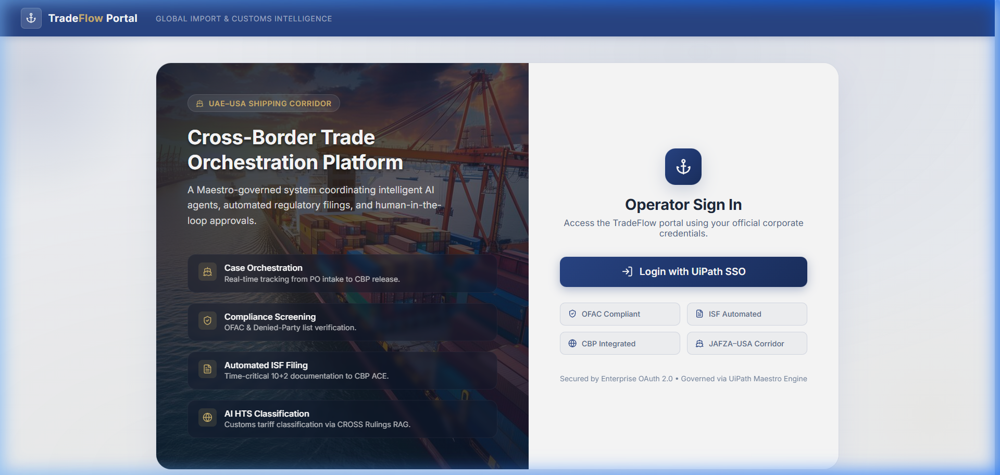
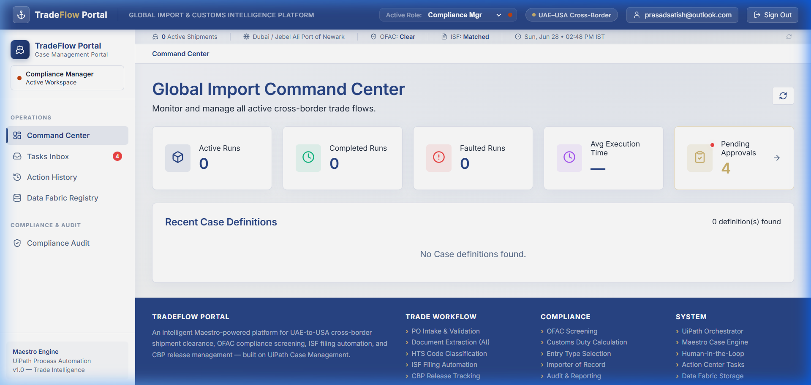
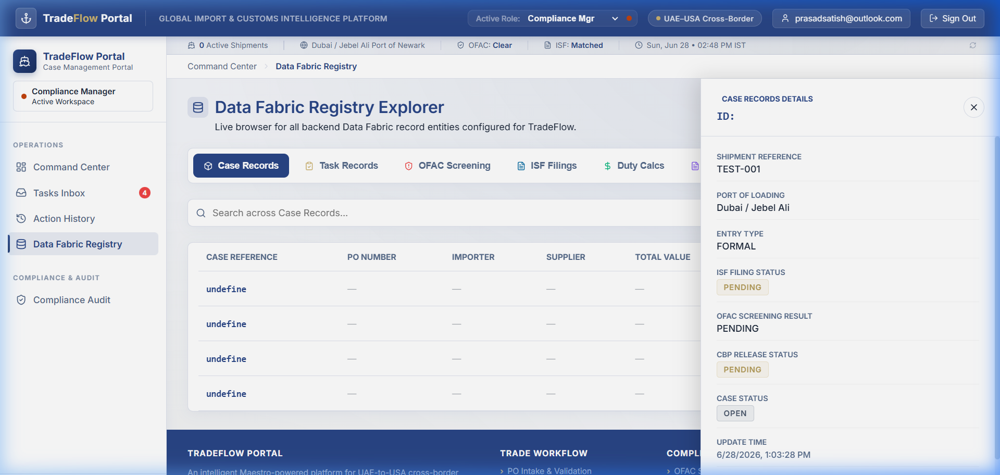
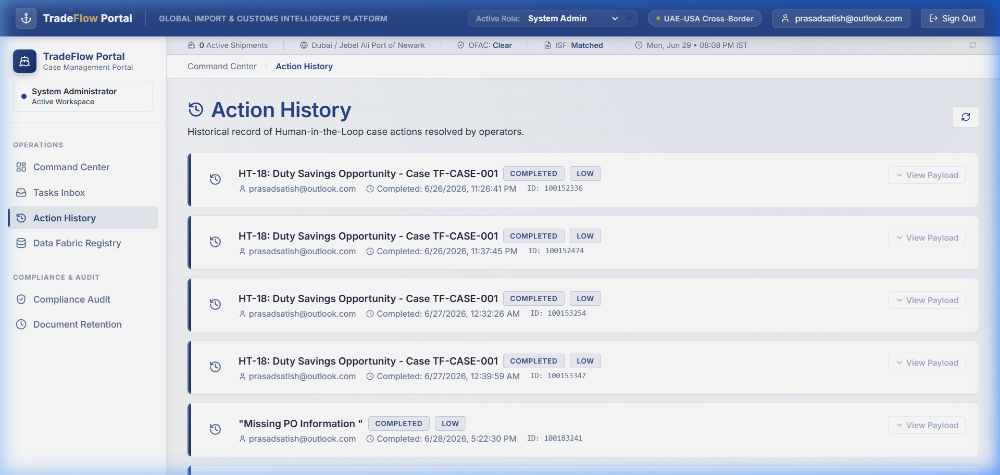
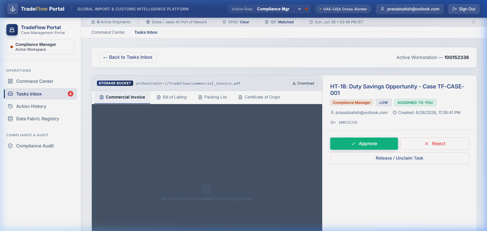
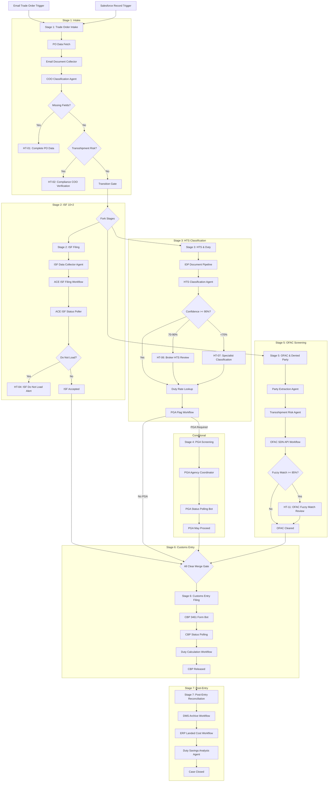
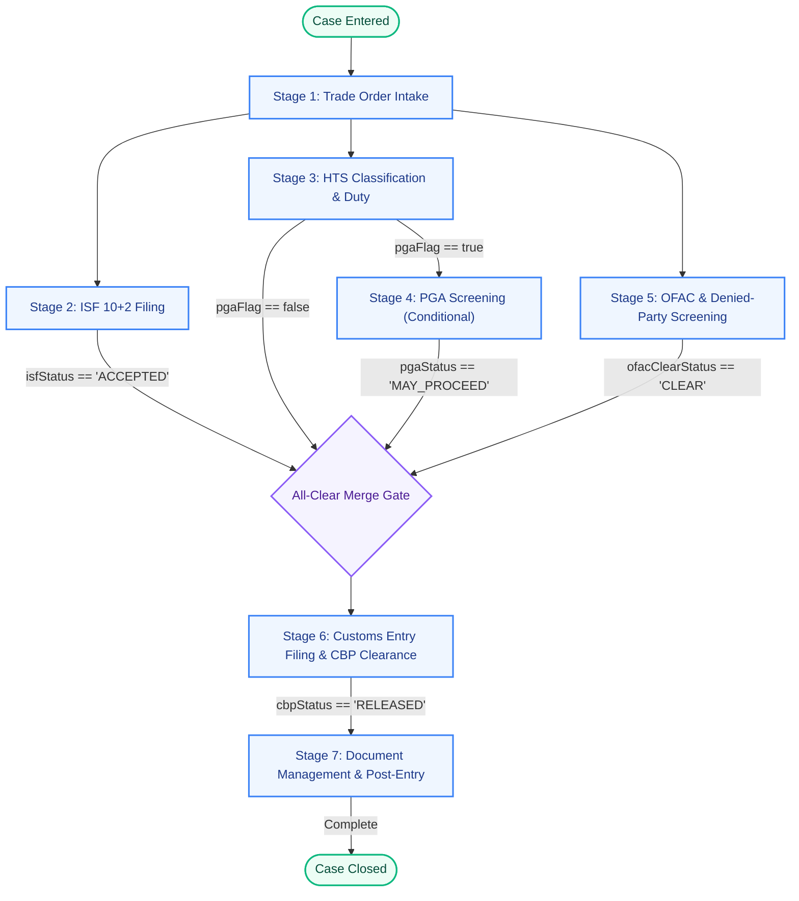

# 🚢 TradeFlowX

### Agentic Import Operations Platform · UAE (Dubai / JAFZA) → USA

---

## Overview

**TradeFlowX** is a fully orchestrated **Agentic Import Operations Platform** that autonomously manages the end-to-end US customs clearance lifecycle for shipments originating from **Dubai and JAFZA (UAE)**.

Built on UiPath Maestro, the platform acts as a **digital Import Operations Manager** — coordinating AI agents, RPA bots, live regulatory APIs, and human reviewers under a single governed workflow.

> **Scope**: US Importer of Record role only. UAE export obligations (EEI, export licenses) are explicitly out of scope.

---

## TradeX Portal Dashboard

The **TradeX Portal** is a Vite + React + TypeScript web application that serves as the central control room for import operations managers. It provides a visual dashboard of active cases, direct database records via the Data Fabric Registry, a dedicated Task Inbox for human-in-the-loop approvals, and a detailed Action History trail.

| Operator Login Page | Main Dashboard Overview |
| :---: | :---: |
|  |  |

| Data Fabric Case Details | Action History Page |
| :---: | :---: |
|  |  |

| Task Workstation & Approval Inbox |
| :---: |
|  |

---

## The Problem & Manual Process Today

Importing goods from the UAE (Dubai/JAFZA) to the USA requires complex customs compliance under tight deadlines. Today, this process is highly manual, error-prone, and slow:

*   ⏳ **ISF 10+2 Filing Race**: Brokers manually gather and key in 10+2 data elements under a strict 24-hour pre-loading deadline, risking $5,000–$10,000 penalties for late filings.
*   🔍 **Manual HTS Classification**: Humans manually classify products against the 17,000-code HTSUS schedule, risking misclassification penalties (42% of all CBP penalties) or incorrect duty applications.
*   🚨 **Transshipment & Sanction Risks**: Free Zones like JAFZA introduce high risks of undeclared Chinese/Iranian origin (escaping Section 301 tariffs) and OFAC screening gaps, as manual SDN checks are rarely re-run continuously.
*   🏛️ **Fragmented PGA & Post-Entry Work**: Coordinating Partner Government Agencies (FDA, USDA, FCC) and manually reconciling CBP 7501 entries to ERP is slow and causes demurrage delays.

Traditional task automation cannot solve this. **TradeFlowX orchestrates the entire import clearance operation.**

---

## Architecture

---

## Workflow Stages

TradeFlowX manages the end-to-end import lifecycle across seven governed stages inside a single case:

1.  **Stage 1 — Trade Order Intake:** Captures PO data from ERP, email, or EDI; validates fields; flags JAFZA transshipment risk and creates the case.
2.  **Stage 2 — ISF 10+2 Filing:** Gathers all 10 importer elements and files with CBP via the ACE API within 24 hours of vessel departure.
3.  **Stage 3 — HTS Classification:** AI classification agent queries the tariff schedule and CBP CROSS rulings to determine HTS-10 codes and duty rates.
4.  **Stage 4 — PGA Agency Screening (Conditional):** Submits PGA message sets (FDA, USDA, FCC, etc.) to ACE and tracks approval status.
5.  **Stage 5 — OFAC & Denied-Party Screening:** Fuzzy-screens suppliers, forwarders, banks, and vessels against sanctions lists (SDN, BIS, SAM.gov).
6.  **Stage 6 — Customs Entry Filing:** Calculates fees, prepares and submits CBP Form 3461 via ACE, and coordinates port release.
7.  **Stage 7 — Post-Entry Reconciliation:** Audits documents via Document Understanding, posts landed costs to ERP, and flags drawback opportunities.

---

## Coded Agents

> ✅ This project uses UiPath coded agents — eligible for judging bonus points.

TradeFlowX deploys **five coded agents** handling distinct compliance domains:

*   **HTS Classification Agent** (LangGraph) — queries the USITC tariff schedule via RAG and scores HTS candidates by confidence.
*   **Transshipment Risk Agent** (LangGraph) — stateful six-node graph that suspends at human checkpoints and resumes on broker approval.
*   **Duty Savings Agent** (LangGraph) — post-entry analysis for First-Sale Valuation and Duty Drawback opportunities.
*   **COO Classifier Agent** (UiPath low-code) — evaluates 13 shipment variables to determine UAE origin and flag transshipment risk.
*   **OFAC Screening Agent** (UiPath low-code) — fuzzy-matches all trade parties against OFAC SDN, BIS Entity List, and SAM.gov.

---

## How AI Helped Us Build Faster

**Claude** was our primary coding partner throughout the build. Using Claude Code with UiPath-specific skills, it authored the entire Maestro case plan, wired all 19 automation tasks and 18 human tasks, scaffolded the coded RPA processes in C#, and handled every deployment cycle — validate, pack, publish, deploy — from the terminal. When something wasn't triggering, Claude diagnosed the structural defect and fixed it. What would have taken days of documentation-reading and trial-and-error became hours.

The **UiPath TypeScript SDK** powered the frontend human task forms. Claude used it to wire all 18 approval forms directly to Maestro Action Center with no backend required — a pattern that kept the entire portal as a single deployable app.

**Gemini** handled trade compliance research — mapping HTS chapters to PGA agencies, compiling ISF 10+2 filing requirements, and drafting CBP query response language for the human review forms. It gave us accurate regulatory content fast, without us having to read through CFR chapters manually.

The split was clean: Gemini for domain knowledge, Claude for building. Together they let a small team deliver a production-grade, seven-stage import compliance platform in hackathon time.

---

## Maestro Parallel Execution Model

---

## Challenges we ran into

*   **Transshipment Complexity:** JAFZA is a UAE free zone — goods manufactured in China but re-exported through JAFZA may or may not qualify as UAE-origin. Resolving this required building a COO Classifier Agent with 13 injected variables to assess "substantial transformation" rather than relying on a static dropdown.
*   **Parallel Stage Sync with Merge Gates:** Coordinating stages 2, 3, and 5 to run in parallel and ensuring Stage 6 does not open until all three are cleared was a complex design challenge. We structured the Maestro case plan so that gate logic is dynamically enforced without creating deadlocks or race conditions.
*   **Accurate SLA Timer Anchoring:** The ISF must be filed 24 hours before vessel loading at Jebel Ali (not before US arrival). Maestro's SLA timer is anchored directly to the vessel departure event sourced from freight forwarder notifications.
*   **Unified Human Task Form Registry:** All 18 forms were successfully packaged inside one Coded Web App without requiring a backend, using a clean registry pattern to handle operations ranging from document uploads to financial data entry and legal escalations.

---

## Accomplishments that we're proud of

*   **End-to-end coverage:** Seven stages, 18 human tasks, full SLA enforcement, and documented integration points for every external system — this is not a demo workflow; it is a production-grade blueprint with task-level automation specs.
*   **True parallel orchestration:** ISF filing, HTS classification, and OFAC screening run simultaneously from case creation — not sequentially — which mirrors how a real customs broker team operates and saves 12–24 hours on a typical clearance timeline.
*   **COO Classifier Agent architecture:** A fully wired `agent.json` with 29 `contentTokens` blocks and 13 runtime-injected variables handling the UAE transshipment / substantial transformation determination — one of the hardest compliance judgments in US import law.
*   **Single-app HT form architecture:** All 18 human-task forms delivered inside one Coded Web App with a clean registry pattern — demonstrating that Maestro human tasks do not require a proliferation of separate deployments.
*   **Compliance depth:** Section 301 tariffs, ADD/CVD, MPF/HMF, ISF 10+2, OFAC SDN, BIS Entity List, PGA message sets, CF-28/CF-29, CBP 7501, duty drawback, first-sale valuation — every relevant US import compliance requirement is modeled as a task or decision gate in the platform.

---

## What we learned

*   **Maestro case plans are the right abstraction for multi-stage import workflows:** The stage-group / task / human-task / SLA-timer model maps almost perfectly to how customs clearance actually works — with parallel tracks, merge gates, and role-based human intervention.
*   **LangGraph's `interrupt()` pattern is the correct primitive for human-in-the-loop AI agents:** Suspending agent state at a decision point, surfacing a task in Maestro Action Center, and resuming the graph on approval is exactly the handshake that enterprise agentic workflows need.
*   **Country-of-origin determination cannot be a rule — it must be an agent decision:** The UAE transshipment / JAFZA scenario involves too many variables (supplier type, product category, manufacturing evidence, certificate text) to encode as a lookup table. LLM-based COO classification with confidence scoring is the correct approach.
*   **UiPath Coded Apps architecture decisions matter early:** The single-app / no-backend constraint had to be established before writing any component code — it fundamentally shapes how `Tasks.complete()` is called and how the form registry is structured.

---

## What's next for TradeFlowX

*   **Live ACE API Integration** — Move from modeled integration to live CBP ACE API calls in a CBP certification environment.
*   **TMS Connector** — Direct integrations with major freight forwarder Transportation Management Systems (e.g., Descartes, CargoWise).
*   **Real-time Vessel Tracking** — Ingest live AIS vessel positioning to dynamically update ETA and departure alerts.
*   **Predictive Exam Selection** — AI model to analyze HTS and supplier combinations to predict the probability of a CBP physical examination.
*   **Global Expansion** — Extend the compliance guidelines and rulesets to additional trade corridors such as India → USA and China → USA.

---

## Reference Guides & Technical Data

All raw schemas, case headers, SLA lists, tech stack breakdowns, and compliance reference terms have been moved to dedicated specification documents:

*   📘 **[Detailed Reference Tables & Compliance Specs](docs/reference_tables.md)** (Human Task Matrix, SLA Timers, Tech Stack APIs, Case Fields, Regulatory Terms)
*   📘 **[System Getting Started Guide](docs/getting_started.md)** (Deployment commands, local setup, run configurations)
*   📘 **[Architecture Guide](docs/architecture.md)** (Deep-dive on Maestro state-machine flow and integration topologies)
*   📘 **[Publishing & Deployment Guide](docs/publishing_and_deployment.md)** (UiPath solution syncing, packing, and staging commands)

---

## License & Author

MIT License — see [LICENSE](LICENSE) for details.

Built for the **UiPath Maestro Hackathon** by [Satish](https://rpabotsworld.com) ([rpabotsworld.com](https://rpabotsworld.com))