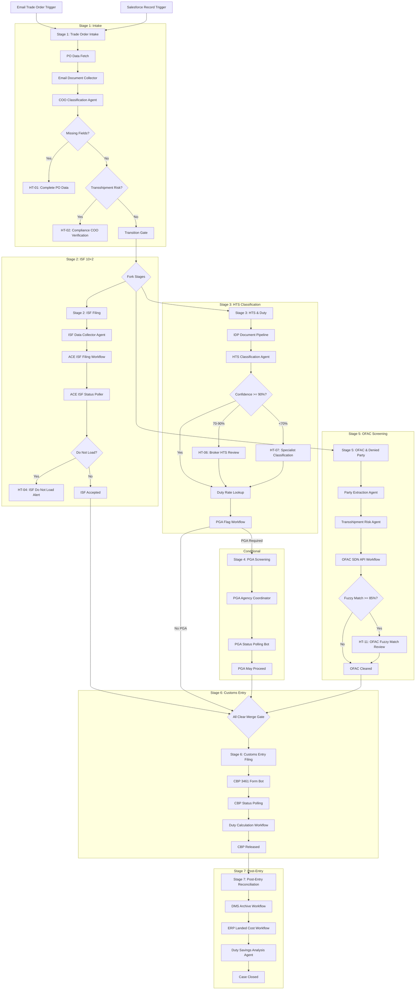

# System Architecture: TradeFlowX

TradeFlowX is a regulated **Agentic Import Operations Platform** designed to manage and orchestrate the full customs clearance lifecycle for imports from Dubai/JAFZA (UAE) to the USA. 

The platform bridges the gap between structured business processes, automated RPA bots, external regulatory APIs, human decision-makers, and autonomous AI agents.

---

## Technical Stack Overview

The platform uses a layered, multi-technology architecture designed for enterprise-grade compliance, auditability, and speed:

| Layer | Component / Tool | Purpose |
|---|---|---|
| **Orchestration** | **UiPath Maestro Case App** | Manages stage transitions, case variables, SLA timers, and parallel execution path orchestration. |
| **User Interface** | **TradeX Portal (Vite/TS Coded App)** | Provides operational dashboards, case header details, and interface views for human operators. |
| **Human Validation** | **UiPath Action Center** | Renders specialized tasks (forms) for compliance, custom brokers, and managers with SLA tracking. |
| **Intelligent Agents** | **LangGraph AI Agents** | Executes complex, non-deterministic tasks (HTS classification, transshipment risk analysis, and duty savings identification). |
| **Data Extraction** | **UiPath Document Understanding** | Extracts structured fields from commercial invoices, bills of lading, and packing lists. |
| **System Operations** | **UiPath Unattended Robots** | Handles browser-based automation on government portals (ACE) and ERP data entry. |
| **Regulatory APIs** | **CBP ACE, USITC, OFAC SDN** | Queries live regulatory and compliance endpoints. |

---

## Architectural Flow Diagram

The following Mermaid diagram shows the lifecycle of a single import shipment case in the system:

---

## Parallel Execution & Sync Model

The platform leverages UiPath Maestro's capability to run stages concurrently. S2 (ISF Filing), S3 (HTS Classification), and S5 (OFAC Screening) kick off immediately following S1 completion.

### The Merge Gate (Convergence Gate)
Stage 6 (Customs Entry Filing) is locked until the following conditions are met:
1.  **ISF 10+2 is Filed & Accepted**: `isfStatus == "ACCEPTED"` (Stage 2 complete).
2.  **HTS Classification is Finalized**: `htsCode != ""` (Stage 3 complete).
3.  **OFAC Screening is Cleared**: `ofacClearStatus == "CLEAR"` (Stage 5 complete).
4.  **PGA Screening is Complete (If Required)**: `pgaStatus == "MAY_PROCEED"` or `pgaFlag == false` (Stage 4 complete or skipped).

This prevents premature customs entry submissions, which are highly regulated and difficult to amend without incurring audits or penalties.

---

## Component Integration Patterns

### 1. LangGraph AI Agents
The three AI agents reside in their respective subdirectories (`03_Agent_HTSClassifier_LangGraph`, `01_Agent_TransshipmentRisk_LangGraph`, `07_Agent_DutySavings_LangGraph`). They are structured using the LangGraph library to maintain state and handle complex branching:
*   **Input/Output Binding**: Triggered via API Workflow tasks that pass JSON parameters and write outputs back into Maestro Case Variables.
*   **State Persistence**: Enables recovery if an LLM call fails or a connection times out.

### 2. TradeX Portal (Coded Web App)
A client-facing web application that queries the active case state. It communicates with Maestro via the `@uipath/uipath-typescript` SDK:
*   **Action Schema (`action-schema.json`)**: Configures custom action-cards for human operators.
*   **Orchestration Bindings**: Map parameters directly into the case workspace for direct dashboard updates.

### 3. Integration Service Connectors
Abstracts standard authentication mechanisms for:
*   **Microsoft Outlook 365**: Listens for intake emails.
*   **Salesforce**: Listens for object creation events.
*   **USITC and OFAC**: Reusable connection models mapped in `bindings_v2.json` to handle API rate-limiting and access token renewal automatically.
